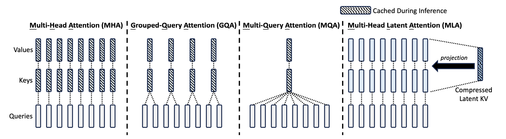

## Table of Contents

1. [Overview](#overview)
2. [Rotary Position Embeddings (RoPE)](#2-rotary-position-embeddings-rope)
3. [Multi-Layer Perceptron](#3-multi-layer-perceptron)
4. [Attention Implementation](#4-attention-implementation)
5. [DecodeLayer](#5-decodelayer)
6. [Putting Together](#6-putting-together)
7. [Extra: Implementation Details](#extra-then-how-does-the-generate-function-in-huggingface-work)

## Overview
This code represents the implementation of LLaMA (Large Language Model Meta AI) in the Hugging Face Transformers library. The implementation includes several key components working together to create an efficient and scalable language model.

### Brief Overview about DeepSeek v2
#### Multi-head Latent Attention

DeepSeek leverages the power of multi-head attention instead of traditional multi-head attention to reduce the heavy KV cache that limits the maximum batch size and sequence length. Since the normal multi-head attention includes the following elements:

$$\mathbf{q}_t$$, $$\mathbf{k}_t$$, $$\mathbf{v}_t$$ is first computed by multiplying the corresponding weight matrix with inputs, and then they  will be sliced into $n_h$ heads for the multi-head attention computation:

$$[\mathbf{q}_{t,1};\mathbf{q}_{t,2};...;\mathbf{q}_{t,n_h}] = \mathbf{q}_t,\tag{1}$$

$$[\mathbf{k}_{t,1};\mathbf{k}_{t,2};...;\mathbf{k}_{t,n_h}] = \mathbf{k}_t,\tag{2}$$

$$[\mathbf{v}_{t,1};\mathbf{v}_{t,2};...;\mathbf{v}_{t,n_h}] = \mathbf{v}_t,\tag{3}$$

$$\mathbf{o}_{t,i} = \sum_{j=1}^t \text{Softmax}_j(\frac{\mathbf{q}_{t,i}^T\mathbf{k}_{j,i}}{\sqrt{d_h}})\mathbf{v}_{j,i},\tag{4}$$

$$\mathbf{u}_t = W^O[\mathbf{o}_{t,1};\mathbf{o}_{t,2};...;\mathbf{o}_{t,n_h}],\tag{5}$$

We need to cache $$2n_hd_hL$$ because For each token, we need to cache both keys (k) and values (v) - this explains the factor of 2
Each key and value has dimension d_h (hidden dimension per head). There are n_h attention heads ,and this needs to be done for sequence length L tokens.

Instead, what DeepSeek V2 did is reducing KV cache through low-rank joint compression:

$$\mathbf{c}_t^{KV} = W^{DKV}\mathbf{h}_t,\tag{6}$$

$$\mathbf{k}_t^C = W^{UK}\mathbf{c}_t^{KV},\tag{7}$$

$$\mathbf{v}_t^C = W^{UV}\mathbf{c}_t^{KV},\tag{8}$$

where:

- $\mathbf{c}_t^{KV} \in \mathbb{R}^{d_c}$ is the compressed shared latent vector for both keys and values
- $d_c$ is the compression dimension, which is much smaller than $d_hn_h$
- $W^{DKV} \in \mathbb{R}^{d_c \times d}$ is the down-projection matrix
- $W^{UK}, W^{UV} \in \mathbb{R}^{d_hn_h \times d_c}$ are up-projection matrices for keys and values

Now we only need to cache $d_cl$ elements, where l is the number of layers.

#### Decoupled RoPE
If you are not familiar with RoPE, I also have brief intro written [here](https://jeffreyzhanghc.github.io/Ilya-30-notes/posts/llama-implementation.html#2-rotary-position-embeddings-rope).

We wanted to incorporate both Rotary Position Embedding (RoPE) and low-rank KV compression, but these two techniques were fundamentally incompatible. Here's why:

RoPE applies position-sensitive transformations to both keys and queries. When using RoPE with compressed keys (k^C), the up-projection matrix W^UK becomes entangled with position-specific RoPE matrices. Due to the non-commutative nature of matrix multiplication, we can no longer absorb W^UK into W^Q during inference - a key optimization in the original design.

To resolve this conflict, a "decoupled RoPE strategy" was developed. The core idea is elegant: we separate the positional encoding concerns from the content processing by introducing:

1. Additional multi-head queries ($$q^R$$) and a shared key ($$k^R$$) specifically for handling positional information
2. These operate in their own dimension space ($$d^R_h$$)
3. The regular content-based processing continues through the compressed pathway

The computation flow becomes:
- Position-aware components are processed through RoPE($$W^{QR} c^Q$$) and RoPE($$W^{KR} h_t$$)
- Content information flows through the compressed pathway
- These are concatenated before the attention computation
- Finally, everything comes together in a unified attention mechanism that considers both content and position

#### MOE (Mixture of Expert) Architecture

Mixture of Experts (MoE) is a neural network architecture that divides the model into specialized subnetworks or "experts". This approach, dating back to 1991, has seen a revival in modern language models including DeepSeek.

**Core Components:**

1. **Expert Networks**: 
   - Multiple specialized neural networks (experts)
   - Each expert handles specific types of inputs
   - In models like Mixtral 8x7B, each layer has 8 experts with 7B parameters each

2. **Gating Network**:
   - Acts as a "traffic controller" between input and experts
   - Determines which experts should handle each input token
   - Assigns weights to combine expert outputs
   - Uses "top-k" routing strategy (e.g., selecting top 2 experts out of 8)

3. **Key Concepts**:

   a) **Sparsity**:
   - Only activates selected experts for each input
   - Reduces computational requirements
   - Particularly effective for complex tasks like language processing
   - Different experts can specialize in different aspects (e.g., idioms vs. grammar)

   b) **Routing Mechanism**:
   - Predicts expert suitability for each input
   - Based on connection strengths between experts and data
   - Uses techniques like "top-k" routing for expert selection

   c) **Load Balancing**:
   - Addresses the challenge of expert utilization
   - Prevents over-reliance on specific experts
   - Uses "noisy top-k gating" with Gaussian noise
   - Promotes even distribution of expert activation

#### DeepSeek MOE
DeepSeekMoE introduces two major strategies to enhance expert specialization:

1. **Fine-Grained Expert Segmentation**:
   - Instead of using large experts, segments each expert into smaller ones
   - Key implementation:
     - Splits each expert FFN into `m` smaller experts
     - Reduces FFN intermediate hidden dimension to 1/m of original size
     - Increases number of activated experts by m times
   - Benefits:
     - More flexible combinations of experts
     - Example: With N=16 experts:
       - Traditional top-2 routing: 120 possible combinations
       - Fine-grained (4-way split): Over 4.4 billion combinations
     - Enables more targeted knowledge acquisition

2. **Shared Expert Isolation**:
   - Dedicates specific experts for common knowledge
   - Implementation details:
     - Isolates Ks experts as "shared experts"
     - Every token passes through these shared experts
     - Reduces activated routed experts by Ks to maintain computation cost
   - Benefits:
     - Reduces parameter redundancy
     - Allows other experts to be more specialized
     - More parameter-efficient model

3. **Load Balancing Improvements**:
   - Uses two types of balance loss:
     - Expert-Level Balance Loss:
       - Prevents routing collapse (over-reliance on few experts)
       - Uses smaller balance factor
     - Device-Level Balance Loss:
       - Ensures balanced computation across devices
       - Uses larger balance factor
     - More flexible than strict expert-level balancing

The key difference from conventional MoE is that DeepSeekMoE focuses on maximizing expert specialization while maintaining computational efficiency, using a combination of finer granularity in expert division and dedicated shared experts for common tasks.

This contrasts with traditional MoE architectures that typically use larger, more general-purpose experts and simpler routing strategies.

